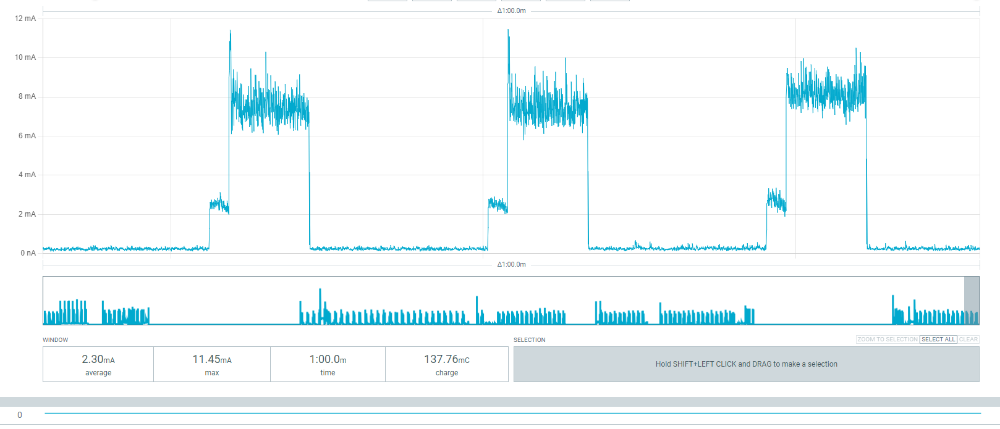
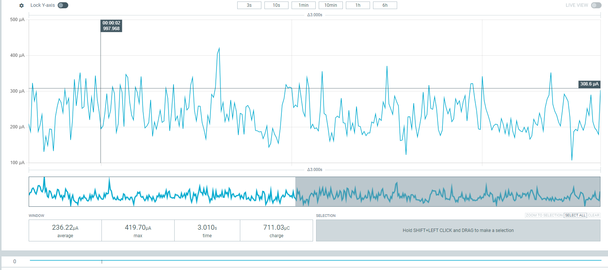

# Powman – Power Management Library for Micropython

The main goal is to reproduce similar low-power timer and wake-up functionalities in [**Micropython**](https://github.com/micropython/micropython). It provides direct access to hardware registers through memory-mapped I/O and is intended for **bare-metal embedded development**.

This project is inspired by and based on the **powman library** implementation available in the [**Raspberry Pi Pico SDK**](https://github.com/raspberrypi/pico-sdk/tree/master) 

The library directly accesses the RP2350 power management and timer registers via memory-mapped I/O. Official documentation can be found in the [**RP2350 datasheet**](https://pip-assets.raspberrypi.com/categories/1214-rp2350/documents/RP-008373-DS-2-rp2350-datasheet.pdf?disposition=inline), especially in Section **6.0** (Power Management Overview and Section **6.4** (Register Configuration)

It is designed to control low-power modes, timers, and wake-up alarms on Raspberry Pi Pico 2.

> [Here](https://github.com/PippoZord/tinygo-powman)  for tinygo library

## Requirements

* Micropython
* Raspberry Pi Pico 2

## Usage

> **Important:** `powmanGetWakeupReason()` must be called **before** `powmanInit()`, because init writes to POWMAN registers that may affect wake-up state.

### 1. Check wake-up reason

```python
import deepsleep

reason = deepsleep.powmanGetWakeupReason()

if reason == 0:
    print("fresh boot")
elif reason & deepsleep.WAKEUP_ALARM:
    print("woke from timer")
elif reason & deepsleep.WAKEUP_GPIO0:
    print("woke from GPIO")
```

### 2. Initialize the timer

Set the absolute system time in milliseconds (must be > 0):

```python
deepsleep.powmanInit(1704067200)
```

### 3. Enter deep sleep

Sleep for a fixed duration (milliseconds):

```python
deepsleep.powmanOffForMs(10000)  # sleep 10 seconds
```

Or sleep until a GPIO goes HIGH:

```python
deepsleep.powmanOffUntilGPIO(15)  # wake on GP15 HIGH
```

Both functions never return — the chip reboots on wake-up.

---

### Full example

```python
import deepsleep
import time

def main():
    reason = deepsleep.powmanGetWakeupReason()  # before init!

    if reason == 0:
        print("fresh boot")
    elif reason & deepsleep.WAKEUP_ALARM:
        print("woke from timer alarm")
    elif reason & (deepsleep.WAKEUP_GPIO0 | deepsleep.WAKEUP_GPIO1 |
                   deepsleep.WAKEUP_GPIO2 | deepsleep.WAKEUP_GPIO3):
        print("woke from GPIO")

    deepsleep.powmanInit(1704067200)
    deepsleep.powmanOffForMs(5000)

main()
```

In `main.py` there is a minimal example`.

Power consumption over one minute.


## Results




The consumption during low power mode




## How It Works

Powman directly accesses memory-mapped registers to control:

* System timer
* Alarm registers
* Power regulator
* Boot configuration
* Interrupt enable flags

The library uses `mem32` internally to read and write hardware registers.

This is required for bare-metal development and is safe in this context.

---

## API Reference

### `powmanGetWakeupReason() → int`

Returns the reason for the last wake-up as a bitmask. Must be called **before** `powmanInit()`.

| Constant | Value | Meaning |
|---|---|---|
| `0` | `0x00` | Fresh boot / software reset |
| `WAKEUP_CHIP_RESET` | `0x01` | Chip-level reset |
| `WAKEUP_GPIO0` | `0x02` | Wake from PWRUP0 (used by `powmanOffUntilGPIO`) |
| `WAKEUP_GPIO1` | `0x04` | Wake from PWRUP1 |
| `WAKEUP_GPIO2` | `0x08` | Wake from PWRUP2 |
| `WAKEUP_GPIO3` | `0x10` | Wake from PWRUP3 |
| `WAKEUP_ALARM` | `0x40` | Wake from timer alarm |

The register is a bitmask: multiple bits can be set simultaneously. Use `&` to test individual sources.

Internally reads `CHIP_RESET.HAD_SWCORE_PD` (bit 25) to confirm a POWMAN sleep occurred, then reads `LAST_SWCORE_PWRUP` (offset `0xA0`) for the source.

---

### `powmanInit(absTimeMs: int, lowPowerXosc=False, lowPowerRosc=False, lowPowerUsbPhy=False, lowPowerWifiChip=False)`

Initializes the POWMAN timer with an absolute timestamp in milliseconds (must be > 0).

The `lowPower*` flags enable the optional extra power-saving steps described in "Going below the RP2350's own domain power-down" below (`stopXosc`/`stopRosc`/`isolateUsbPhy`/`powerDownWifiChip`). Enabling them here means every subsequent `powmanOff*()` call applies them automatically — no need to build a `beforeSleep` callback yourself just to use the built-in optimizations. `lowPowerXosc` takes effect immediately; the other three are deferred and applied last, right before the chip halts.

---

### `powmanOffForMs(sleepingMs: int, beforeSleep=None)`

Enters deep sleep and reboots after `sleepingMs` milliseconds. Never returns.

---

### `powmanOffUntilGPIO(gpio: int, high: bool = True, slot: int = PWRUP0, beforeSleep=None)`

Enters deep sleep and reboots when the specified GPIO pin reaches the target level. `gpio` must be 0–49. Never returns.

| Parameter | Description |
|---|---|
| `gpio` | GPIO pin number (0–49) |
| `high` | `True` = wake on HIGH, `False` = wake on LOW |
| `slot` | Which of the 4 PWRUP registers to use (`PWRUP0`..`PWRUP3`). Defaults to `PWRUP0`. |
| `beforeSleep` | Optional callable, invoked last, right before the chip actually halts (see "Going below the RP2350's own domain power-down" below). |

> **Important:** The GPIO must already be at the **opposite** level before calling this function.
> POWMAN requires a level **transition** to fire — if the GPIO is already at the wake level when sleep is entered, the chip will never wake.
>
> | `high` | GPIO must be before sleep | Wake trigger |
> |---|---|---|
> | `True` | LOW | GPIO goes HIGH |
> | `False` | HIGH | GPIO goes LOW |

---

### `powmanOffUntilAnyGPIO(pins: list[tuple[int, bool]], beforeSleep=None)`

Enters deep sleep and reboots when **any** of up to 4 GPIO pins reaches its target level. `pins` is a list/tuple of up to 4 `(gpio, high)` pairs, each mapped to one of the 4 independent PWRUP wake-up slots. Never returns.

```python
# wake when GP15 goes HIGH or GP16 goes LOW
deepsleep.powmanOffUntilAnyGPIO([(15, True), (16, False)])
```

The same transition requirement as `powmanOffUntilGPIO` applies to every pin. After reboot, use `powmanGetWakeupReason()` to tell which one fired: `pins[0]` → `WAKEUP_GPIO0`, `pins[1]` → `WAKEUP_GPIO1`, and so on.

---

### `powmanOffForMsOrGPIO(sleepingMs: int, pins: list[tuple[int, bool]], beforeSleep=None)`

Enters deep sleep and reboots when **either** the timer alarm expires **or** any of up to 4 GPIO pins reaches its target level — whichever happens first. Never returns.

```python
# wake after 10s, or immediately if GP15 goes HIGH before that
deepsleep.powmanOffForMsOrGPIO(10000, [(15, True)])
```

Same transition requirement as `powmanOffUntilGPIO`/`powmanOffUntilAnyGPIO` applies to every pin. After reboot, `powmanGetWakeupReason()` tells you which source actually fired: `WAKEUP_ALARM` for the timer, `WAKEUP_GPIO0`..`WAKEUP_GPIO3` for `pins[0]`..`pins[3]`.

---

## Going below the RP2350's own domain power-down (experimental)

`powmanOff*()` powers down SWCORE/XIP/SRAM0/SRAM1 (RP2350 low-power state P1.7). Everything below is optional, additional current savings on top of that, all included directly in `deepsleep.py`. Enable whichever you want via `powmanInit()`'s `lowPower*` flags — no `beforeSleep` callback needed:

```python
import deepsleep

deepsleep.powmanInit(1704067200, lowPowerXosc=True, lowPowerRosc=True,
                      lowPowerUsbPhy=True, lowPowerWifiChip=True)

deepsleep.powmanOffForMsOrGPIO(10000, [(8, True)])
```

Internally, `lowPowerXosc` calls `stopXosc()` right away (safe to do early), while `lowPowerRosc`/`lowPowerUsbPhy`/`lowPowerWifiChip` are deferred and applied automatically inside `_powmanPowerOff()`, right before the chip actually halts — after arming the alarm/GPIOs, in the right order. If you need something custom beyond these four, every `powmanOff*()` still accepts a `beforeSleep` callable, invoked right after the automatic ones.

- **`stopXosc()` / `stopRosc()`** — the crystal oscillator (XOSC) and ring oscillator (ROSC) live in the always-on domain and keep running (and drawing current) even after `powmanOff*()`. `stopXosc()` moves `clk_ref`/`clk_sys` onto ROSC and stops the crystal; `stopRosc()` moves them again onto POWMAN's internal LPOSC (32.768 kHz — thousands of times slower than the normal system clock) and stops ROSC too. Because of that slowdown, `stopRosc()` is always applied last, after arming the alarm/GPIOs, while they were still armed on the faster ROSC.

  **Risk**: if clocks aren't moved off an oscillator before it's stopped, the chip hangs and needs a physical reset/reflash (BOOTSEL) to recover. Only tested on Pico 2 (RP2350) with stock boot clock configuration.

- **`isolateUsbPhy()`** — re-isolates the USB PHY (`MAIN_CTRL.PHY_ISO`) before sleeping, matching the exact methodology the RP2350 datasheet itself uses for its own published low-power figures (section 14.9.7.2). Lower risk than `stopXosc`/`stopRosc`: doesn't touch `clk_sys`/`clk_ref`, so no clock-hang risk — any USB activity in flight just disconnects a little earlier than the reboot-on-wake would do anyway.

- **`powerDownWifiChip()`** — **Pico 2 W only**. Powers down the CYW43439 wireless companion chip by driving its regulator-enable line (`WL_REG_ON`, GP23 on this board, confirmed in the official Pico 2 W datasheet) low. This chip is entirely separate from the RP2350 — POWMAN has no control over it — so if it's ever powered on (e.g. by touching `Pin("LED", ...)` or the `network` module), it adds its own baseline current regardless of how far XOSC/ROSC/USB PHY are pushed down. No-op if the chip was never powered up in the first place; not applicable on plain Pico 2.

In testing (Pico 2 W, all of the above combined), sleep current went from ~600µA to ~230-250µA measured on VSYS. The remaining gap versus the RP2350 datasheet's own P1.7 figure (~56µA, measured directly on the chip's 3V3 pin) is most likely the onboard SMPS regulator's own light-load overhead — VSYS is measured upstream of that regulator, so the RP2350's own consumption alone is probably much closer to the datasheet figure.

---

## Debugging tip: no serial output after wake-up

Waking up (from timer or GPIO) triggers a full chip reboot, which also resets the USB stack. Your serial terminal has to reconnect to the newly re-enumerated USB device, and usually doesn't do so fast enough to catch the first `print()` calls in `main()`.

To verify wake-up behavior without relying on the serial terminal, blink the onboard LED a different number of times depending on `powmanGetWakeupReason()` — it's visible immediately and doesn't depend on USB reconnecting.

```python
from machine import Pin
import time, deepsleep

def blink(times):
    led = Pin("LED", Pin.OUT)
    for _ in range(times):
        led.on()
        time.sleep_ms(200)
        led.off()
        time.sleep_ms(200)

def main():
    reason = deepsleep.powmanGetWakeupReason()  # before init!

    if reason & deepsleep.WAKEUP_GPIO0:
        blink(1)   # woke from GP8
    elif reason & deepsleep.WAKEUP_GPIO1:
        blink(2)   # woke from GP9
    elif reason & deepsleep.WAKEUP_GPIO2:
        blink(3)   # woke from GP10
    elif reason & deepsleep.WAKEUP_GPIO3:
        blink(4)   # woke from GP11
    elif reason & deepsleep.WAKEUP_ALARM:
        blink(5)   # woke from timer alarm
    else:
        blink(6)   # fresh boot / other

    deepsleep.powmanInit(1704067200)
    deepsleep.powmanOffUntilAnyGPIO([(8, True), (9, True), (10, True), (11, True)])

main()
```

---

## Completed

- Timer-based deep sleep (`powmanOffForMs`)
- GPIO wake-up (`powmanOffUntilGPIO`)
- Multi-GPIO wake-up (`powmanOffUntilAnyGPIO`)
- Combined timer + multi-GPIO wake-up (`powmanOffForMsOrGPIO`)
- Wake-up reason detection (`powmanGetWakeupReason`)

## Future Developments

- Optimize power management by disabling unnecessary components
- Implement a sleep mode that does not reboot the system and preserves the values of variables like `machine.lightsleep()`
## Safety Notes

* Only use in embedded/bare-metal environments.
* Incorrect register values may brick your device.


## Supported Platforms

Tested primarily on:

* Raspberry Pi Pico 2
